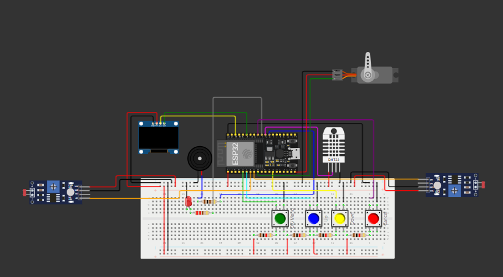
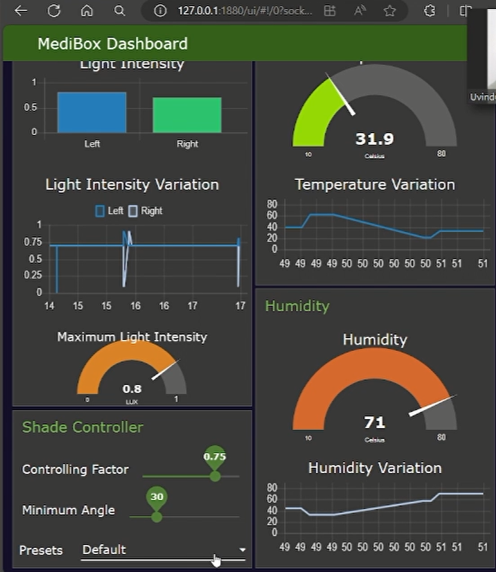

# Smart MediBox

## Introduction
The MediBox Embedded Systems and Networks Project aims to develop a smart pharmaceutical storage system capable of managing medicines effectively. This documentation outlines the design, implementation, and functionalities of the embedded software that controls the MediBox hardware components.

## System Overview
The MediBox system comprises several hardware components including an OLED screen, buzzer, push buttons, Light Dependent Resistors (LDRs), and a servo motor. The software components encompass embedded software for hardware control, an NTP client for time synchronization, an alarm management system, temperature/humidity monitoring, light intensity monitoring, and a user interface for configuration and interaction.




## Functionalities

### Core Functionalities
- **Time Synchronization**: Set time zone and synchronize time with NTP server.
- **Alarm Management**: Set and manage alarms, including disabling all alarms.
- **Display Time**: Show the current time on the OLED screen.
- **Alarm Notifications**: Trigger alarms with audible and visual indications; stop alarms using push buttons.
- **Environmental Monitoring**: Monitor temperature and humidity levels, with warnings for unhealthy limits.
- **Light Intensity Monitoring**: Use LDRs to monitor light intensity and display real-time and historical data on Node-RED dashboard.
- **Servo Motor Control**: Adjust the shaded sliding window position based on light intensity and user-defined parameters for different medicines.

### Advanced Functionalities
- **Persistent Storage**: Save alarms and user settings in non-volatile memory.
- **User-Friendly Interface**: Provide a menu-driven OLED screen interface for configuration and interaction.
- **Change Detection**: Utilize on-change detection for sensors to minimize power usage.
- **Continuous Monitoring**: Maintain continuous monitoring of temperature, humidity, and light intensity.

## Software Architecture

### Hardware Abstraction Layer
- Simplifies interaction with hardware components like the OLED display, buzzer, buttons, LDR sensors, and servo motor.
- Abstracts hardware-specific details for easier software development and potential hardware adaptations.

### Sensor Management
- Handles data acquisition from the DHT sensor (temperature and humidity) and LDRs (light intensity).
- Processes and stores sensor data for environmental monitoring and visualization on Node-RED dashboard.

### Alarm Management
- Allows users to set, disable, and manage medication alarms.
- Activates the buzzer and displays notifications on the OLED screen when alarms are triggered.
- Stores alarm configurations in non-volatile memory for persistence across power cycles.

### Time Management
- Synchronizes system time with an NTP server for accurate timekeeping.
- Allows configuration of a custom time zone offset from UTC.
- Saves the time zone offset in non-volatile memory for persistent operation.

### User Interface
- Provides a menu-driven interface on the OLED display for navigation and configuration using push buttons.
- Allows configuring alarms, setting time zones, and viewing system status information.
- Displays warning messages when temperature or humidity levels exceed predefined thresholds.

### Communication Management
- Establishes a secure connection with an MQTT broker for remote data transmission and control.
- Publishes sensor data (temperature, humidity, light intensity) to designated topics on the MQTT broker for visualization and analysis on the Node-RED dashboard.
- Subscribes to specific topics to receive control commands for the servo motor, enabling remote adjustments to the shaded sliding window.

This modular architecture ensures clear separation of concerns, enhances maintainability, and allows for future expansion of functionalities and integration of additional components.



## Hardware Components
Essential hardware components for the MediBox system include:

- **ESP32 Development Board**: Main controller providing processing power and connectivity.
- **OLED Display**: Provides visual feedback, displaying current time, alarm notifications, and system status.
- **Buzzer**: Generates audible alarms for medication reminders.
- **Push Buttons**: Enable user interaction for navigating menus, setting alarms, and acknowledging notifications.
- **Light Dependent Resistors (LDRs)**: Monitor ambient light intensity to adjust the shaded sliding window.
- **Servo Motor**: Controls the movement of the shaded sliding window based on LDR input and user-defined parameters.

> **Note**: Changes in hardware components will affect the configuration settings.

## Requirements

### Hardware Components
- ESP32 Development Board
- OLED Display
- Buzzer
- Push Buttons
- Light Dependent Resistors (LDRs)
- Servo Motor

### Software Components
- Wokwi
- Node-RED
- MQTT Broker
- VSCode

## Installation

### Hardware Installation
- Connect the components as specified in the Port Map.

### Software Installation
1. Clone the repository:
    ```sh
    git clone https://github.com/uvinduuu/Smart-Medibox.git
    ```
2. Open arduino IDE and upload the [sketch](Software/sketch02.ino) .
3. Install Node-RED following the [official documentation](https://nodered.org/docs/getting-started/).
4. Import the Node-RED flow from the repository.
5. Run the Project:
    - Upload the firmware to the ESP32 development board.
    - Run the Node-RED server using the command `node-red` in the terminal.
    - Open the Node-RED dashboard in the browser using the URL `http://localhost:1880/ui`.

## Simulation
Set up the Workwi simulator for the project. The setup guide and simulation details can be found [here](Wokwi%20Simulation).

